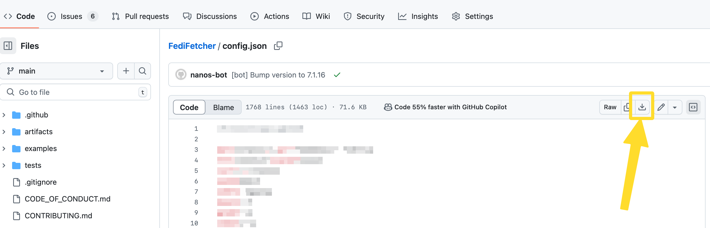
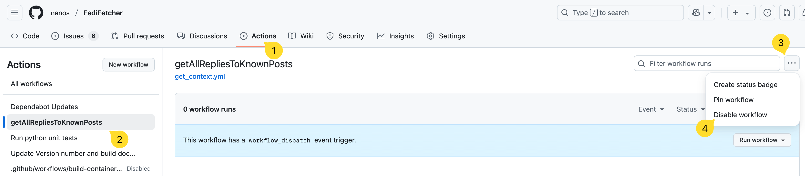

In April 2025 GitHub removed a dependency that is needed to run FediFetcher as GitHub Action. 

> [!IMPORTANT]  
> If you are currently running FediFetcher as GitHub Action, you will need to run FediFetcher using another mechanism going forward. **You will have until 20th June 2025 to do so**.

This document outlines the basic steps needed to migrate FediFetcher:

## 1. Get your configuration script.

You will need to grab a copy of your configuration options. You should find this in the `config.json` file in the root of your fork of FediFetcher. In order to download the file, click on it in the main repository view, then click the Download icon in the top menu bar as seen below:



## 2. Disable the existing GitHub Action

You will need to disable the GitHub Action. In order to do so, return to your own fork of FediFetcher. 

1. Click on the 'Actions' tab.
2. Find the 'getAllRepliesToKnownPosts' workflow in the left column.
3. Click the three dots at the top right.
4. Choose 'Disable Workflow'



## 2. Get a new Access Token

You will need to be able to reset your Access Token. Please refer to [Get an Access Token](https://github.com/nanos/FediFetcher/wiki/Getting-an-access-token-for-FediFetcher) to find out how.

You will want to add the Access Token to the `config.json` file that you downloaded in step 1.

In order to do that, open up the file in your favourite editor, and add it on it's own line like so: `"access-token": "Your access token",`. The final file should look something like this:

```json
{
  "access-token": "Your access token",
  "server": "your.mastodon.server",
  // your other settings below
}
```

Please refer to [FediFetcher configuration options](https://github.com/nanos/FediFetcher/wiki/FediFetcher-configuration-options) for all configuration options

## 3. Decide how you wish to run FediFetcher going forward.

You should pick from one of the following options. Each individual guide will tell you where to store your `config.json` file that you downloaded earlier:<br>

   - [Running FediFetcher as a cron job](https://github.com/nanos/FediFetcher/wiki/Running-FediFetcher-as-a-cron-job)<br>
     Ideal if you already have a linux device, and want to simply run FediFetcher on there.
   - [Running FediFetcher from a container](https://github.com/nanos/FediFetcher/wiki/Running-FediFetcher-from-a-container)<br>
      Ideal if you are familiar with containers.
   - [Running FediFetcher as a systemd timer](https://github.com/nanos/FediFetcher/wiki/Running-FediFetcher-as-a-systemd-timer)<br>
     Ideal if you have a linux device somewhere, but don't like cron jobs.
   - [Running FediFetcher as a Scheduled Task in Windows](https://github.com/nanos/FediFetcher/wiki/Running-FediFetcher-as-a-Scheduled-Task-in-Windows)<br>
     Ideal if you are a Windows User and your main device is (almost) always running.

## Questions?

Please feel free to [open an Issue](https://github.com/nanos/FediFetcher/issues) on GitHub. 